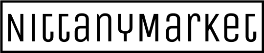

<!-- PROJECT LOGO -->
 

  

<!-- TABLE OF CONTENTS -->

  
Table of Contents

  <ol>
    <li>
      <a href="#about-the-project">About NittanyMarket</a>
      <ul>
        <li><a href="#tech-stack">Tech Stack</a></li>
        <li><a href="#design-decisions">Design Decisions</a></li>
      </ul>
    </li>
    <li><a href="#contact">Contact</a></li>
  </ol>

<!-- ABOUT THE PROJECT -->
## About The Project

NittanyMarket is an eBay-like E-commerce platform for the fictional school Nittany State University (NSU) -- its faculty, staff, students, and local businesses. NSU reached out to Penn State to enlist computer science students to design and implement a prototype for the platform.

### Tech Stack

* [Express.js](https://expressjs.com): Backend web framework built on Node.js to handle all NittanyMarket business logic
* [Bootstrap](https://getbootstrap.com): CSS framework for quick front end development
* [MariaDB](https://mariadb.com): RDBMS to handle all NittanyMarket data 
* [Redis](https://redis.io): in-memory database to manage user session data

### Design Decisions

* Model-View-Controller design pattern
* RESTful API
* [Sequelize](https://sequelize.org) ORM abstraction layer for MariaDB for cleaner, more maintainable code

<!-- CONTACT -->
## Contact

Chase McFarlane - [@ChaseDevMac](https://linkedin.com/ChaseDevMac) - ChaseDevMac@protonmail.com

